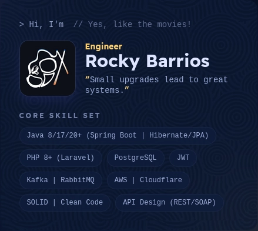

<!-- Made with GPRM -->

**Backend Engineer**
# STEVEN BARRIOS.
**Spain | +34 685 50 80 13 | rockystevendeveloper@gmail.com | [linkedin.com/in/rockydev101](https://linkedin.com/in/rockydev101) | [Portfolio](https://101rockyprojects.github.io/portafolio/)** <br/>
*Backend Engineer with 4+ years of experience building robust and scalable systems, specialized in APIs,
REST/SOAP microservices and clean architectures (DDD, Hexagonal, TDD, CQRS) with SOLID principles.*
> “Small upgrades lead to great systems.”


## 💻 Skill Set:
*Languages & Frameworks*




*Databases, Persistence & Messaging*


*Development Tools*


---

## ⚡ Resume:
**Backend Engineer** with **4+ years** of experience, specialising in building **robust APIs** and **scalable microservices** using clean architectures (Hexagonal, DDD, CQRS) and SOLID principles.

``` 
🔭 Currently: Focused on event-driven systems with Kafka and RabbitMQ.
🧠 My hallmark: Documentation that optimises teams (-50% fewer meetings) and an obsessive focus on code quality.
🏅 Fun fact: 100th percentile in quantitative reasoning (national) and 3rd place in a programming marathon.
🤝 Looking for: To contribute to open-source projects that improve the developer experience in distributed systems.
```


## **Let's build something together!**
Watch some of my most interesting projects...

    
